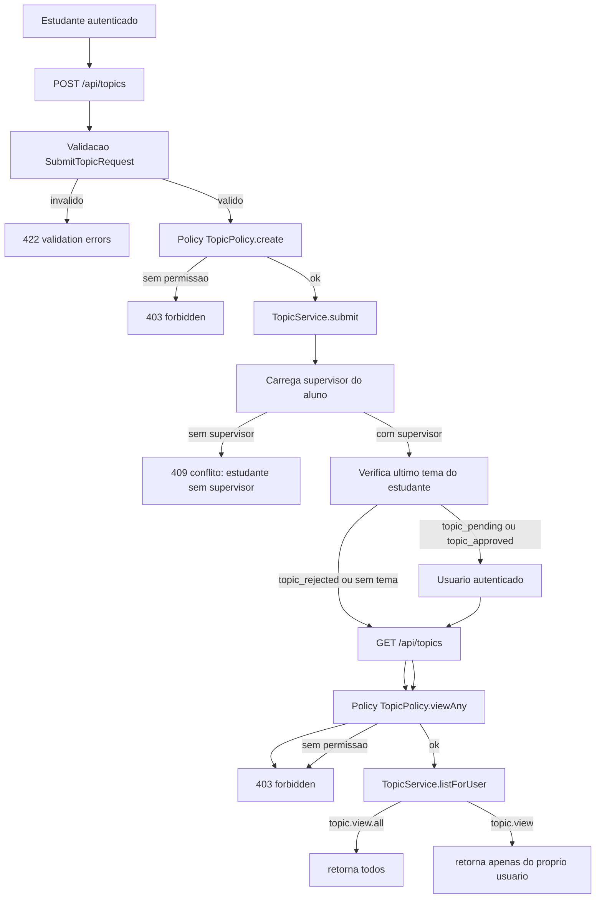

# Modulo Protocol - Implementacao e Fluxo (Fase 1)

## Objetivo da fase

Entregar a primeira vertical funcional do modulo Protocol: **submissao de temas**.

Esta fase cobre:

- estrutura modular no backend (padrao semelhante ao modulo Auth)
- persistencia do tema em tabela propria
- regras de validacao da submissao
- verificacao de temas similares (aviso, nao bloqueante)
- atribuicao do tema ao supervisor do estudante
- seguranca por autenticacao + RBAC (roles/permissions) com Policy

---

## Escopo implementado

### 1. Estrutura de codigo criada/ajustada

- `Modules/Protocol/app/Models/Topic.php`
- `Modules/Protocol/app/Http/Requests/SubmitTopicRequest.php`
- `Modules/Protocol/app/Services/TopicService.php`
- `Modules/Protocol/app/Http/Controllers/TopicController.php`
- `Modules/Protocol/app/Policies/TopicPolicy.php`
- `Modules/Protocol/database/migrations/2026_07_02_100000_create_topics_table.php`
- `Modules/Protocol/routes/api.php`
- `Modules/Protocol/app/Providers/ProtocolServiceProvider.php`

### 2. Rotas ativas desta fase

- `POST /api/topics` - submeter tema
- `GET /api/topics` - listar temas (contextual por permissao)

### 3. Banco de dados (topics)

Campos principais da tabela:

- `student_id` (FK users)
- `supervisor_id` (FK teacher_profiles)
- `scientific_area_id` (FK scientific_areas)
- `course_id` (FK courses)
- `title`
- `status` (default: `topic_pending`)
- `supervisor_status` (default: `pending`)
- `supervisor_decision_at` (nullable)
- `justification` (nullable)
- `submitted_at`
- `timestamps`
- `softDeletes`

Indices:

- `student_id + status`
- `status + created_at`

---

## Fluxo funcional atual

---

## Regras de negocio aplicadas nesta fase

1. Campos obrigatorios para submissao:
- titulo
- area cientifica
- curso

2. Integridade area x curso:
- `course_id` so e aceito se pertencer a `scientific_area_id` enviada.

3. Estado inicial do tema:
- todo tema novo entra como `topic_pending`.

4. Similaridade de titulos:
- compara com temas `topic_approved`
- retorna lista de similares com percentual
- **nao bloqueia** submissao

5. Supervisor do aluno:
- a submissao do tema exige que o estudante tenha supervisor atribuido
- o tema e gravado com o supervisor do aluno
- o estado de aprovacao do supervisor passa a integrar o ciclo de vida do tema

6. Visibilidade de listagem:
- usuario com `topic.view.all` ve todos os temas
- usuario com `topic.view` ve apenas os proprios temas

---

## Seguranca e conformidade RBAC

### Controles aplicados

1. Autenticacao
- endpoints protegidos por `auth:sanctum`.

2. Autorizacao por Policy
- `TopicPolicy::create` exige permissao `topic.create`
- `TopicPolicy::viewAny` exige `topic.view` ou `topic.view.all`

3. Permissoes e roles
- o sistema usa o modelo de roles/permissoes ja semeado no modulo Auth
- verificacao de permissao acontece via `User::hasPermission(...)`

4. Isolamento de dados
- sem `topic.view.all`, o backend restringe retorno ao proprio `student_id`.

### Checklist de seguranca (fase 1)

- [x] Endpoint sem token retorna 401 (Sanctum)
- [x] Endpoint com token sem permissao retorna 403 (Policy)
- [x] Endpoint com permissao retorna dados autorizados
- [x] Nao ha escrita de tema fora do usuario autenticado
- [x] Integridade referencial por FKs no banco
- [x] Submissao bloqueada quando o estudante nao tem supervisor atribuido

---

## O que fica para a fase 2

Para completar o ciclo de tema (US-003 + transicoes), ainda falta:

- aprovar tema (`PATCH /api/topics/{id}/approve`)
- rejeitar tema com justificacao (`PATCH /api/topics/{id}/reject`)
- notificacoes (secretario recebe nova submissao, estudante recebe decisao)
- auditoria de transicao de estado (historico)

---

## Evidencias tecnicas da fase

- migration aplicada com sucesso (`create_topics_table`)
- rotas `topics` registradas no `route:list`
- policy ativa no provider do modulo Protocol
